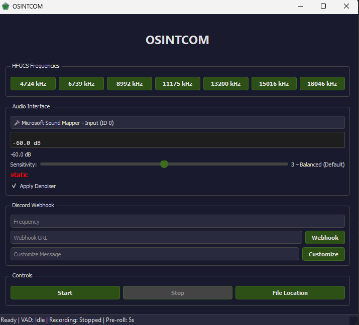

# OSINTCOM v1.0

Professional-grade **voice activity detection (VAD) and recording tool** for HF radio SSB monitoring with Discord integration. Captures faint voice while rejecting static noise.



**Features:**
- 🎙️ Real-time audio monitoring with visual meter
- 🔊 Listens to **Mic In** or **Speaker Output** (WASAPI loopback on Windows)
- 🎯 **SSB-optimized VAD** with 5 sensitivity levels (rejects static, catches faint voice)
- 📊 Spectral analysis for intelligent static rejection
- ⏱️ Records **5 seconds pre-voice + 10 seconds post-silence** (countdown resets on new voice)
- 📁 Saves as 16-bit PCM WAV files
- 🔗 Discord webhook integration with custom messages & role pings
- 🔇 Optional noise reduction filter (noisereduce)
- 🎨 Modern dark theme GUI with live frequency/status display
- 💾 Standalone .exe for Windows (no Python installation required)

---

## Installation

### Option 1: Python Script (Windows/Mac/Linux)

**Requirements:** Python 3.8+

```bash
# Clone or download this repository
cd OSINTCOM

# Create virtual environment (optional but recommended)
python -m venv venv
source venv/bin/activate  # Linux/Mac
venv\Scripts\activate     # Windows

# Install dependencies
pip install -r requirements.txt
```

### Option 2: Standalone Windows Executable

Download `OSINTCOM.exe` from GitHub Releases — no Python required!

```bash
OSINTCOM.exe
```

---

## Usage

### Running the Application

**Python:**
```bash
python osintcom_qt.py
```

**Standalone EXE:**
```
Double-click OSINTCOM.exe
```

### Using the GUI

1. **Select Audio Source:**
   - Click the dropdown under "Audio Interface"
   - Choose your input: Microphone (🎤), Loopback/Stereo Mix (🔊), or USB device

2. **Select Frequency:**
   - Check one of the HFGCS frequency buttons (4.724 - 18.046 MHz)
   - Or use Custom mode to enter your own

3. **Configure Discord Webhook:**
   - Paste your Discord webhook URL in the "Webhook URL" field
   - Click "Customize" to set role pings and message text

4. **Adjust Sensitivity:**
   - Slide the sensitivity bar (1=Faintest, 5=Voice Only)
   - Monitor the VAD indicator (green=voice, red=no voice)

5. **Start Listening:**
   - Click "Start" to begin monitoring
   - Audio meter shows real-time levels
   - Recordings automatically save to `~/Documents/OSINTCOM/`
   - Click "File Location" to open the folder

---

## VAD (Voice Activity Detection) Sensitivity

The VAD uses **spectral analysis** to distinguish voice from static:

| Level | Name | Best For | Behavior |
|-------|------|----------|----------|
| **1** | Maximum | Weak/faint signals | Catches faintest voice; more false positives on static |
| **2** | Relaxed | Typical SSB | Good balance; catches weak voice with minimal false triggers |
| **3** | Balanced (Default) | SSB radio | Recommended; steady performance on typical conditions |
| **4** | Strict | Clean channels | Rejects more noise; may miss weakest voice |
| **5** | Voice Only | Voice isolation | Maximum static rejection; use only for clear voice |

**How it Works:**
- **Energy Check:** Audio must exceed minimum dB threshold
- **Spectral Flatness:** Static = flat spectrum (rejected); Voice = peaks in frequency content
- **Zero-Crossing Rate:** Distinguishes voice (moderate) from noise (very high)
- **Pitch Periodicity:** Voice has periodic structure; static is random

→ **Tip:** Start at Level 3. If you miss voice, go to 2 or 1. If you catch too much static, go to 4 or 5.

---

## Troubleshooting

### Audio Not Detected / No Devices Showing

**On Windows:** Check if you have an audio input device available.

Run this in PowerShell:
```powershell
Get-PnpDevice | Where-Object { $_.Class -eq "MEDIA" } | Select-Object Name, Status
```

### Can't Listen to Speakers (Loopback Not Available)

**Problem:** OSINTCOM doesn't see "Stereo Mix" or "Loopback" device.

**Solution 1: Enable Windows Stereo Mix (if available)**
1. Right-click the speaker icon in system tray → **Open Sound settings**
2. Scroll down → **Advanced** → **App volume and device preferences**
3. Look for "Stereo Mix" in the device list
4. If it's disabled (grayed out):
   - Right-click (in older Windows) → **Show Disabled Devices**
   - Right-click "Stereo Mix" → **Enable**
5. Restart OSINTCOM and select "Stereo Mix" from the dropdown

**If "Stereo Mix" doesn't appear:** Your audio driver may not support it.

**Solution 2: Install Virtual Audio Cable** (Recommended if no Stereo Mix)
1. Download and install one of:
   - **VB-Audio Virtual Cable** (free): https://vb-audio.com/Cable/
   - **VoiceMeeter** (free): https://vb-audio.com/Voicemeeter/
   - **Virtual Audio Cable** (paid): https://vb-audio.com/

2. After installation, restart OSINTCOM
3. Select the virtual device from the dropdown (e.g., "VB-Audio Virtual Cable")
4. Route system audio through the virtual cable in Windows Sound Settings

### Still Detecting Static as Voice

1. Increase sensitivity level (4 or 5)
2. Check that your input device is not picking up excessive background noise
3. Test with a known voice source to verify detection works
4. Try the optional denoiser (check "Enable Denoiser") for additional filtering

### Discord Messages Not Sending

1. **Verify webhook URL:**
   - Check that the Discord webhook URL is copied correctly (should start with `https://discord.com/api/webhooks/`)
   - Test in browser: paste URL and you should see a 405 error (that's correct!)

2. **Check Discord channel permissions:**
   - Bot must have "Send Messages" and "Embed Links" permissions
   - Role ID must exist and be valid

3. **Internet connectivity:**
   - Verify your PC can reach Discord (ping discord.com)

### WAV Files Not Saving

1. Ensure `~/Documents/OSINTCOM/` exists and is writable
2. Check disk space (each minute of audio ≈ 5.3 MB)
3. Filenames use format: `YYYYMMDD_HHMMSS.wav`

---

## Discord Setup

### Creating a Webhook

1. Go to your Discord server → **Server Settings** → **Integrations**
2. Click **Webhooks** → **New Webhook**
3. Name it (e.g., "OSINTCOM Radio") and choose a channel
4. Click **Copy Webhook URL**
5. Paste into OSINTCOM's "Webhook URL" field

### Role Pings

To ping a role when voice is detected:
1. In Discord: Right-click the role name → **Copy User ID**
2. In OSINTCOM: Click "Customize" and paste the role ID
3. Messages will include `<@&ROLE_ID>` to notify the role

---

## Dependencies

- **sounddevice**: Audio I/O
- **numpy**: Signal processing
- **scipy**: Spectral analysis & filtering
- **requests**: Discord webhook HTTP
- **noisereduce** (optional): Noise reduction filter
- **PyQt5**: GUI framework

All included in `requirements.txt`.

---

## Building from Source

To build `OSINTCOM.exe` yourself:

```bash
pip install PyInstaller
python build_exe.py
```

Output: `dist/OSINTCOM.exe` (~112 MB)

---

## Configuration Files

- **osintcom_qt.py**: Main application (GUI + VAD)
- **requirements.txt**: Dependencies
- **build_exe.py**: PyInstaller build script
- **.gitignore**: Excludes venv, builds, recordings, temp files

---

## Performance Notes

- **CPU Usage:** Minimal (<5% typical)
- **Memory:** ~100-150 MB (with all dependencies)
- **Latency:** <100 ms from voice detection to recording start
- **Audio Format:** 44.1 kHz, 16-bit mono
- **Recording Overhead:** ~5.3 MB/minute

---

## Limitations

- **Windows & WASAPI:** Loopback audio (speaker output) requires Windows + compatible audio driver
- **macOS/Linux:** Microphone input works; speaker loopback depends on OS audio subsystem
- **Static Rejection:** SSB radio environments with extreme noise may need tuning
- **Real-time Processing:** VAD runs on received audio blocks (~46 ms at 44.1 kHz)

---

## Future Improvements

- [ ] Frequency preset profiles (different sensitivity for each band)
- [ ] Multi-frequency monitoring simultaneously
- [ ] Advanced noise reduction (DeepFilter, SEGAN)
- [ ] Audio archive uploading to cloud storage
- [ ] Web-based dashboard for remote monitoring

---

## License

[Specify your license here - MIT, GPL, etc.]

## Support

For issues or feature requests, please open an issue on GitHub.

---

**OSINTCOM v1.0** | Created for professional HF radio monitoring.
